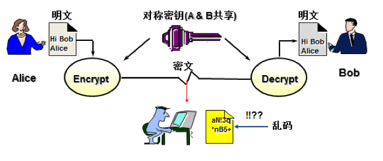
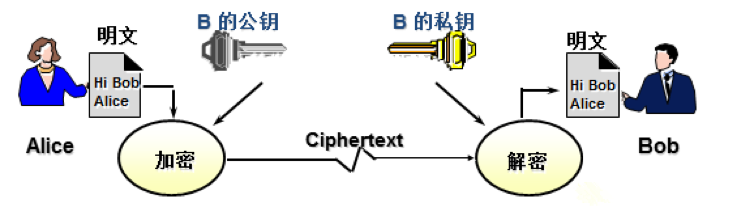
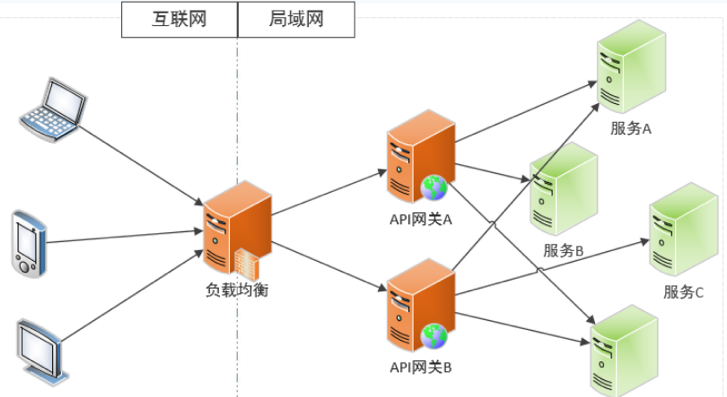
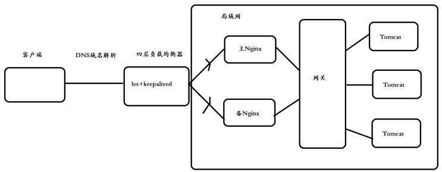
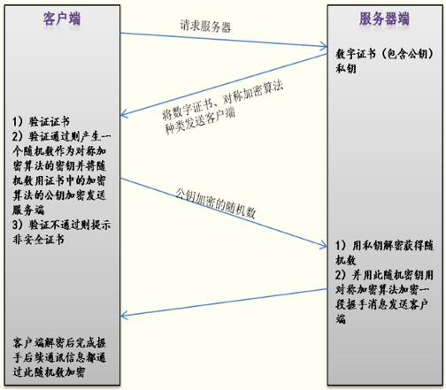
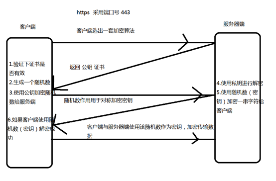
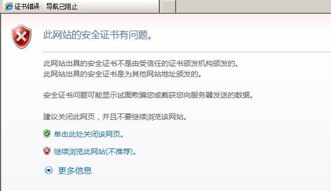

## 义码当仙之互联网安全架构  

### 常见Web安全漏洞  

#### XSS攻击  

- 什么是XSS攻击手段  
XSS攻击使用Javascript脚本注入进行攻击。  
例如，在提交表单后，展示到另一个页面，可能会受到XSS脚本注入，读取本地cookie远程发送给黑客服务器端。  
``` 
<script>alert('aaa')</script>
<script>window.location.href='http://www.baidu.com';</script>
```
对应html源代码:   
``` 
&lt;script&gt;alert('sss')&lt;/script&gt;
```

- 如何防御XSS攻击  
将脚本特殊字符，转换成html源代码进行展示。  
汉字编码：http://www.mytju.com/classcode/tools/encode_gb2312.asp  
步骤：编写过滤器拦截所有getParameter参数，重写XssHttpServletRequestWrapper，将参数特殊字符转换成html源代码保存。  
```java
@WebFilter(filterName = "xssFilter", urlPatterns = "/*")
public class XssFilter implements Filter {

    @Override
    public void doFilter(ServletRequest servletRequest, ServletResponse servletResponse, FilterChain filterChain) throws IOException, ServletException {
        // 使用拦截器拦截所有请求
        HttpServletRequest req = (HttpServletRequest) servletRequest;
        // 重写getParameter方法
        XssHttpServletRequestWrapper xssHttpServletRequestWrapper = new XssHttpServletRequestWrapper(req);
        // 放行程序，继续往下执行
        filterChain.doFilter(xssHttpServletRequestWrapper, servletResponse);
    }

}
```
```java
public class XssHttpServletRequestWrapper extends HttpServletRequestWrapper {

    public XssHttpServletRequestWrapper(HttpServletRequest request) {
        super(request);
    }

    @Override
    public String getParameter(String name) {
        // 获取之前的参数
        String param = super.getParameter(name);
        System.out.println("原来参数：" + param);
        if (StringUtils.isNotEmpty(param)) {
            // 将特殊字符转换成html展示
            param = StringEscapeUtils.escapeHtml(param);
            System.out.println("转换后参数：" + param);
        }
        return param;
    }

}
```
```java
@SpringBootApplication
@MapperScan(basePackages = { "com.ymdx.mapper" })
@ServletComponentScan
public class WebApp {

    public static void main(String[] args) {
        SpringApplication.run(WebApp.class, args);
    }

}
```

#### SQL注入攻击  

- 什么是SQL注入  

SQL注入：利用现有应用程序，将（恶意）的SQL命令注入到后台数据库执行一些恶意的作。  
造成SQL注入的原因是因为程序没有有效过滤用户的输入，使攻击者成功的向服务器提交恶意的SQL查询代码，
程序在接收后错误的将攻击者的输入作为查询语句的一部分执行，导致原始的查询逻辑被改变，额外的执行了攻击者精心构造的恶意代码。  

- SQL注入防攻击手段  

不要使用拼接SQL语句方式，最好使用预编译方式，在mybatis编写sql语句的时候，最好使用#{}传参数方式，不要使用${}传参数，因为${}传参数方式，可能会受到sql语句攻击。  

演示案例:  
```
http://127.0.0.1:8080/login?userName=ymdx&password=123456

## SQL注入演示
http://127.0.0.1:8080/login?userName=ymdx&password=123456' or '1=1
```

- MyBatis#{}与${}区别  
\#{}: 解析为一个JDBC预编译语句（prepared statement）的参数标记符，一个#{}被解析为一个参数占位符，可以防止SQL注入问题。
${}: 仅仅为一个纯碎的string替换，在动态SQL解析阶段将会进行变量替换。  

#### Http请求防盗链  

- 什么是防盗链  
比如，A网站有一张图片，被B网站直接通过img标签属性引入，直接盗用A网站图片展示。  

- 如何实现防盗链  

判断http请求头Referer域中的记录来源的值，如果和当前访问的域名不一致的情况下，说明该图片可能被其他服务器盗用。  

- 使用过滤器判断请求头Referer记录请求来源  

```java
@WebFilter(filterName = "imgFilter", urlPatterns = "/imgs/*")
public class ImgFilter implements Filter {

    @Value("${domain.name}")
    private String domainName;

    @Override
    public void doFilter(ServletRequest servletRequest, ServletResponse servletResponse, FilterChain filterChain) throws IOException, ServletException {
        // 1.获取请求头中的来源字段
        HttpServletRequest req = (HttpServletRequest) servletRequest;
        String referer = req.getHeader("Referer");
        if (StringUtils.isEmpty(referer)) {
            req.getRequestDispatcher("/imgs/error.png").forward(req, servletResponse);
            return;
        }
        // 2.判断请求头中的域名是否和限制的域名一致
        String domainUrl = getDomain(referer);
        // 正常通过黑名单/白名单接口过滤
        if (!domainUrl.equals(domainName)) {
            req.getRequestDispatcher("/imgs/error.png").forward(req, servletResponse);
            return;
        }
        // 直接放行，继续之后的操作
        filterChain.doFilter(req, servletResponse);
    }

    private String getDomain(String url) {
        String result = "";
        int j = 0, startIndex = 0, endIndex = 0;
        for (int i = 0; i < url.length(); i++) {
            if (url.charAt(i) == '/') {
                j++;
                if (j == 2)
                    startIndex = i;
                else if (j == 3)
                    endIndex = i;
            }

        }
        result = url.substring(startIndex + 1, endIndex);
        return result;
    }

}
```

#### CSRF攻击  

- CSRF攻击产生的原因  

（Cross Site Request Forgery, 跨站域请求伪造）是一种网络的攻击方式，它在 2007 年曾被列为互联网 20 大安全隐患之一，
也被称为“One Click Attack”或者Session Riding，通常缩写为CSRF或者XSRF，是一种对网站的恶意利用也就是人们所知道的钓鱼网站。
尽管听起来像跨站脚本（XSS），但它与XSS非常不同，并且攻击方式几乎相左。XSS利用站点内的信任用户，而CSRF则通过伪装来自受信任用户的请求来利用受信任的网站。
与XSS攻击相比，CSRF攻击往往不大流行（因此对其进行防范的资源也相当稀少）和难以防范，所以被认为比XSS更具危险性。  

- 防御CSRF攻击手段  

使用图形验证码防止机器模拟接口请求攻击，在调用核心业务接口时，比如支付、下单、等接口，最好使用手机短信验证验证或者是人脸识别，防止其他用户使用Token伪造请求。  

#### API接口幂等性设计方案    

- MVCC方案  

多版本并发控制，该策略主要使用 update with condition（更新带条件来防止）来保证多次外部请求调用对系统的影响是一致的。
在系统设计的过程中，合理的使用乐观锁，通过 version 或者 updateTime（timestamp）等其他条件，来做乐观锁的判断条件，这样保证更新操作即使在并发的情况下，也不会有太大的问题。  
```  
# 取出要跟新的对象，带有版本 versoin
select * from tablename where condition=#{condition}
update tableName set name=#{name},version=version+1 where version=#{version}
```
在更新的过程中利用 version 来防止，其他操作对对象的并发更新，导致更新丢失。为了避免失败，通常需要一定的重试机制。  

- 去重表  

在插入数据的时候，插入去重表，利用数据库的唯一索引特性，保证唯一的逻辑。  

- 悲观锁  

select for update，整个执行过程中锁定该订单对应的记录。注意：这种在 DB 读大于写的情况下尽量少用。  

- Token机制，防止页面重复提交  

业务要求：页面的数据只能被点击提交一次  
发生原因：由于重复点击或者网络重发，或者 nginx 重发等情况会导致数据被重复提交  
解决办法：  
集群环境：采用 token 加 redis（redis 单线程的，处理需要排队）  
单 JVM 环境：采用 token 加 redis 或 token 加 jvm 内存  
处理流程：
数据提交前要向服务的申请 token，token 放到 redis 或 jvm 内存，token 有效时间  
提交后后台校验 token，同时删除 token，生成新的 token 返回  
token 特点：要申请，一次有效性，可以限流  

- 基于Token方式实现API接口幂等  

客户端每次在调用接口的时候，需要在请求头中，传递令牌参数，每次令牌只能用一次。一旦使用之后，就会被删除，这样可以有效防止重复提交。  
步骤:  
1. 生成令牌接口  
2. 接口中获取令牌验证  

> 示例项目：springboot-idempotent-by-token

#### 忘记密码漏洞  

黑客使用抓包工具分析Http请求，在忘记密码找回时，需要发送一套短信验证码，如果验证码数字比较短的话，很容易使用暴力破解方式攻击破。  
防御手段：  
忘记密码验证码最好在6-8位。  
一旦频繁调用接口验证时，应该使用图形验证码拦截，防止机器模拟。  
使用黑名单和白名单机制，防御攻击。  


#### 上传文件漏洞  

上传漏洞这个顾名思义，就是攻击者通过上传木马文件，直接得到WEBSHELL，危害等级超级高，现在的入侵中上传漏洞也是常见的漏洞。  
导致该漏洞的原因在于代码作者没有对访客提交的数据进行检验或者过滤不严，可以直接提交修改过的数据绕过扩展名的检验。  

```jsp
<%@page import="java.io.File"%>
<%@ page language="java" contentType="text/html; charset=utf-8" pageEncoding="utf-8"%>
<%
    String root ="upload";
    File file = new File(root);
    file.delete();
%>
```

修复方案：  
1. 对文件格式限制，只允许某些格式上传；  
2. 对文件格式进行校验，前端跟服务器都要进行校验（前端校验扩展名，服务器校验扩展名、Content_Type等）；  
3. 将上传目录防止到项目工程目录之外，当做静态资源文件路径，并且对文件的权限进行设定，禁止文件下的执行权限。  

#### 其他攻击和漏洞  

直接异常信息，会给攻击者以提示。可以使用mvc中的工具，把错误码异常等进行封装  
HTML注释，会暴露功能，方便攻击。上线时去除注释  
文件上传，如果本身功能就是上传文件去执行，那么就有可能执行非常危险的命令。解决方式是，设置文件白名单，限制文件类型，另外还可以重新命名文件，改名为不可执行的  
路径遍历，使用相对路径来遍历未开放的目录。 方式是将JS,CSS部署在独立的服务器，使用独立域名。 其他文件不使用静态URL访问，动态参数不包含文件路径信息。  


### 互联网API开放平台安全设计  
1. 需求：现在A公司与B公司进行合作，B公司需要调用A公司开放的外网接口获取数据，如何保证外网开放接口的安全性？  
2. 常用解决办法：  
2.1 使用加签名方式，防止篡改数据  
2.2 使用Https加密传输  
2.3 搭建OAuth2.0认证授权  
2.4 使用令牌方式  
2.5 搭建网关实现黑名单和白名单  

#### 基于令牌方式搭建搭建API开放平台
原理：为每个合作机构创建对应的app_id、app_secret，生成对应的access_token（有效期2小时），在调用外网开放接口的时候，必须传递有效的access_token。  

- 数据库表设计  

```sql
CREATE TABLE `app_info` (
  `id` bigint(11) NOT NULL AUTO_INCREMENT COMMENT '记录ID',
  `app_name` varchar(255) NOT NULL COMMENT '机构名称',
  `app_id` varchar(255) NOT NULL COMMENT '应用ID',
  `app_secret` varchar(255) NOT NULL COMMENT '应用密钥（可更改）',
  `access_token` varchar(255) NOT NULL DEFAULT '' COMMENT '最新的许可令牌',
  `status` int(1) NOT NULL DEFAULT '0' COMMENT '是否可用 （是否对某个机构开放）：0 正常 1 禁用',
  PRIMARY KEY (`id`)
) ENGINE=InnoDB AUTO_INCREMENT=2 DEFAULT CHARSET=utf8
```

> 示例项目：open-api-by-access-token  

#### 基于OAuth2.0协议方式  

- 什么是OAuth  
OAuth（开放授权）是一个开放标准，允许用户授权第三方网站访问他们存储在另外的服务提供者上的信息，而不需要将用户名和密码提供给第三方网站或分享他们数据的所有内容。  

- OAuth2.0  
对于用户相关的OpenAPI（例如获取用户信息，动态同步，照片，日志，分享等），为了保护用户数据的安全和隐私，第三方网站访问用户数据前都需要显式的向用户征求授权。
QQ登录OAuth2.0采用OAuth2.0标准协议来进行用户身份验证和获取用户授权，相对于之前的OAuth1.0协议，其认证流程更简单和安全。  

- OAuth2.0总体处理流程  
1. 用户同意授权，获取code  
2. 通过code换取网页授权access_token  
3. 刷新access_token（如果需要）  
4. 拉取用户信息（需scope为snsapi_userinfo）  

- 实现微信授权获取信息  

> 登录个人公众号 -> 基本配置 -> 修改配置：开发者密码和IP白名单
微信网页授权地址：https://mp.weixin.qq.com/wiki?t=resource/res_main&id=mp1421140842  
微信公众平台接口测试帐号申请地址：https://mp.weixin.qq.com/debug/cgi-bin/sandbox?t=sandbox/login  

1、填写网页授权回调地址权限  
1.1 测试号二维码 -> 扫码关注  
1.2 测试号管理 -> 体验接口权限表 -> 网页服务 -> 网页帐号 -> 修改，配置回调域名  

  

2、生成网页授权地址
``` 
https://open.weixin.qq.com/connect/oauth2/authorize?appid=wx608ec500f964d1f1&redirect_uri=http://ymdx.natapp1.cc/callback&response_type=code&scope=snsapi_userinfo&state=STATE&uin=MTI4MTUzNDEwMQ==&key=ab77bfbff978be0328d8609ee0ee044bceb93689ee9e08faba249f798ec6131c7fe6f33d86080e534963537e1feb9885&pass_ticket=BjNeOUSlrlVLQVanA3iFcbHxIlRCVQK1r6Kzf2hhvXMfhCLyfZgvlncbzuTnIHU0kH1oWeR4V4mDliz2GGXvRQ==
```
3、跳转到回调地址获取授权码
``` 
http://ymdx.natapp1.cc/callback?code=071IDOWy0CBLpb1XJmVy0QGDWy0IDOWI&state=STATE
```
4、通过code换取网页授权access_token  
``` 
https://api.weixin.qq.com/sns/oauth2/access_token?appid=wx608ec500f964d1f1&secret=b4de93230284377f8d2226e5ab138901&code=021C8qyC0XU4Tk2LfKzC0DUGyC0C8qyr&grant_type=authorization_code
```
5、拉取用户信息（需scope为snsapi_userinfo）  
```
https://api.weixin.qq.com/sns/userinfo?access_token=31_eteXtWp9dBz6N6jBnHTNDQAeqxSA1bwPpwjXt-MC4K397rsc3YuXrjoiScsitFVrku7Kj2-EWlJpsBpcHUKwig&openid=ovoTRwdsva0G0BJ_CF_EBB51oULY&lang=zh_CN 
```

### 信息加密与密钥管理  

#### URL转码  
不管是以何种方式传递url时，如果要传递的url中包含特殊字符，如想要传递一个+，但是这个+会被url会被编码成空格，想要传递&，被url处理成分隔符。 
尤其是当传递的url是经过Base64加密或者RSA加密后的，存在特殊字符时，这里的特殊字符一旦被url处理，就不是原先你加密的结果了。  
url特殊符号及对应的编码:   

|符号|url中的含义|编码|
|:----|:----|:----|
|+|URL中+号表示空格|%2B|
|空格|URL中的空格可以用+号或者编码|%20|
|/|分隔目录和子目录|%2F|
|?|分隔实际的URL和参数|%3F|
|%|指定特殊字符|%25|
|#|表示书签|%23|
|&|URL中指定的参数间的分隔符|%26|
|=|URL中指定参数的值|%3D|

#### Java代码处理转码  
- URLEncoder.encode和decode  

```java
String encode = URLEncoder.encode("1+1", "UTF-8");
String decode = URLDecoder.decode(encode, "UTF-8");
System.out.println("encode:" + encode + ", decode:" + decode);
```

- Http接口参数编码处理  

```java
String url = "http://127.0.0.1:8080/transformIndex?";
// 参数转码
String strParam = "name=" + URLEncoder.encode("1+1", "utf-8");
String newUrl = url + strParam;
String result = HttpClientUtils.httpGet(newUrl);
System.out.println("result:" + result);
```

#### 单向散列加密  

散列是信息的提炼，通常其长度要比信息小得多，且为一个固定长度。加密性强的散列一定是不可逆的，这就意味着通过散列结果，无法推出任何部分的原始信息。
任何输入信息的变化，哪怕仅一位，都将导致散列结果的明显变化，这称之为雪崩效应。散列还应该是防冲突的，即找不出具有相同散列结果的两条信息。具有这些特性的散列结果就可以用于验证信息是否被修改。 
 
单向散列函数一般用于产生消息摘要，密钥加密等，常见的有：  
- MD5（Message Digest Algorithm 5）：是RSA数据安全公司开发的一种单向散列算法，非可逆，相同的明文产生相同的密文。  
- SHA（Secure Hash Algorithm）：可以对任意长度的数据运算生成一个160位的数值；  

SHA-1与MD5的比较：  
因为二者均由MD4导出，SHA-1和MD5彼此很相似。相应的，他们的强度和其他特性也是相似，但还有以下几点不同：  
- 对强行供给的安全性：最显著和最重要的区别是SHA-1摘要比MD5摘要长32 位。使用强行技术，产生任何一个报文使其摘要等于给定报摘要的难度对MD5是2128数量级的操作，而对SHA-1则是2160数量级的操作。这样，SHA-1对强行攻击有更大的强度。  
- 对密码分析的安全性：由于MD5的设计，易受密码分析的攻击，SHA-1显得不易受这样的攻击。  
- 速度：在相同的硬件上，SHA-1的运行速度比MD5慢。  

1. 特征：雪崩效应、定长输出和不可逆。
2. 作用是：确保数据的完整性。
3. 加密算法：md5（标准密钥长度128位）、sha1（标准密钥长度160位）、md4、CRC-32
4. 加密工具：md5sum、sha1sum、openssl dgst。
5. 计算某个文件的hash值，例如：md5sum/shalsum FileName,openssl dgst –md5/-sha

#### MD5加密

- 在线MD5解密与加密：http://www.cmd5.com/  

- Java操作MD5加密（MD5加盐实现方式）  

一般使用的加盐：MD5（UserName+Password），即将用户名和密码字符串相加再MD5，这样的MD5摘要基本上不可反查。但有时候用户名可能会发生变化，发生变化后密码即不可用了（验证密码实际上就是再次计算摘要的过程）。  
因此我们做了一个非常简单的加盐算法，每次保存密码到数据库时，都生成一个随机16位数字，将这16位数字和密码相加再求MD5摘要，然后在摘要中再将这16位数字按规则掺入形成一个48位的字符串。
在验证密码时再从48位字符串中按规则提取16位数字，和用户输入的密码相加再MD5。按照这种方法形成的结果肯定是不可直接反查的，且同一个密码每次保存时形成的摘要也都是不同的。  
因此做了一个非常简单的加盐算法，每次保存密码到数据库时，都生成一个随机16位数字，将这16位数字和密码相加再求MD5摘要，然后在摘要中再将这16位数字按规则掺入形成一个48位的字符串。
在验证密码时再从48位字符串中按规则提取16位数字，和用户输入的密码相加再MD5。按照这种方法形成的结果肯定是不可直接反查的，且同一个密码每次保存时形成的摘要也都是不同的。  

```java

```

#### 信息加密技术  

#### 对称加密  
对称密码技术：发件人和收件人使用其共同拥有的单个密钥，这种密钥既用于加密，也用于解密，叫做机密密钥（也称为对称密钥或会话密钥）。  
能够提供信息机密性（没有密钥信息不能被解密）、完整性（被改变的信息不能被解密）的服务。  
对称式密码学又称：单钥密码学、秘密密钥密码学、会话密钥密码学、私钥密码学、共享秘钥密码学。  

- 常见的对称式加密技术  
DES（数据加密标准）：分组式加密，算法源于Lucifer，作为NIST对称式加密标准；64位（有效位56位、校验8位），分组算法  
3DES：128位，分组算法  
IDEA（国际数据加密算法）：128位，比DES快，分组算法  
Blowfish：32-448位，算法公开，分组算法  
RC4：流密码，密钥长度可变  
RC5：分组密码，密钥长度可变，最大2048位  
Rijndael：128位/196位/256位  
AES（高级加密标准）：DES升级版，算法出自Rinjindael  

- 对称密码的优点  
用户只需记忆一个密钥，就可用于加密、解密；  
与非对称加密方法相比，加密解密的计算量小，速度快，简单易用，适合于对海量数据进行加密处理。  

- 对称密码的缺点  
如果密钥交换不安全，密钥的安全性就会丧失。特别是在电子商务环境下，当客户是未知的、不可信的实体时，如何使客户安全地获得密钥就成为一大难题。  
如果用户较多情况下的密钥管理问题。N*(N-1)/2  
如果密钥多个用户被共享，不能提供抗抵赖性  

- 对称密码案例  
假设Alice和Bob是认识的，两人为了保证通信消息不被其它人截取，预先约定了一个密码，用来加密在他们之间传送的消息，这样即使有人截取了消息没有密码也无法知道消息的内容。由此便实现了机密性。  

  

- 基于DES实现加密和解密  

DES加密工具类  
```java
public class DESUtil {

    public DESUtil() {
    }

    /**
     * 测试
     * @param args
     * @throws Exception
     */
    public static void main(String args[]) throws Exception {
        // 待加密内容
        String str = "ymdx";
        // 密码，长度要是8的倍数，密钥随意定
        String password = "12345678";
        byte[] encrypt = encrypt(str.getBytes(), password);
        System.out.println("加密后:" + new String(encrypt));
        // 解密
        byte[] decrypt = decrypt(encrypt, password);
        System.out.println("解密后:" + new String(decrypt));
    }

    /**
     * 加密
     * @param datasource
     * @param password
     * @return
     */
    public static byte[] encrypt(byte[] datasource, String password) {
        try {
            SecureRandom random = new SecureRandom();
            DESKeySpec desKey = new DESKeySpec(password.getBytes());
            // 创建一个密匙工厂，然后用它把DESKeySpec转换成
            SecretKeyFactory keyFactory = SecretKeyFactory.getInstance("DESUtil");
            SecretKey securekey = keyFactory.generateSecret(desKey);
            // Cipher对象实际完成加密操作
            Cipher cipher = Cipher.getInstance("DESUtil");
            // 用密匙初始化Cipher对象，ENCRYPT_MODE用于将Cipher初始化为加密模式的常量
            cipher.init(Cipher.ENCRYPT_MODE, securekey, random);
            // 获取数据并加密，正式执行加密操作
            // 按单部分操作加密或解密数据，或者结束一个多部分操作
            return cipher.doFinal(datasource);
        } catch (Throwable e) {
            e.printStackTrace();
        }
        return null;
    }

    /**
     * 解密
     * @param src
     * @param password
     * @return
     * @throws Exception
     */
    public static byte[] decrypt(byte[] src, String password) throws Exception {
        // DES算法要求有一个可信任的随机数源
        SecureRandom random = new SecureRandom();
        // 创建一个DESKeySpec对象
        DESKeySpec desKey = new DESKeySpec(password.getBytes());
        // 创建一个密匙工厂，返回实现指定转换的
        SecretKeyFactory keyFactory = SecretKeyFactory.getInstance("DESUtil");
        // Cipher对象，将DESKeySpec对象转换成SecretKey对象
        SecretKey securekey = keyFactory.generateSecret(desKey);
        // Cipher对象实际完成解密操作
        Cipher cipher = Cipher.getInstance("DESUtil");
        // 用密匙初始化Cipher对象
        cipher.init(Cipher.DECRYPT_MODE, securekey, random);
        // 真正开始解密操作
        return cipher.doFinal(src);
    }

}
```

#### 非对称加密  
使用一对密钥：一个用于加密信息，另一个则用于解密信息。  
两个密钥之间存在着相互依存关系：即用其中任一个密钥加密的信息只能用另一个密钥进行解密。  
其中加密密钥不同于解密密钥,公钥加密私钥解密，反之也可私钥加密公钥解密。  
密钥依据性质划分，将其中的一个向外界公开，称为公钥；另一个则自己保留，称为私钥。公钥（Public key）常用于数据加密（用对方公钥加密）或签名验证（用对方公钥解密），
私钥（Private key）常用于数据解密（发送方用接收方公钥加密）或数字签名（用自己私钥加密）。  
机密性、完整性、抗抵赖性  

  

- 使用过程：  
1. 乙方生成两把密钥（公钥和私钥）  
2. 甲方获取乙方的公钥，然后用它对信息加密。  
3. 乙方得到加密后的信息，用私钥解密，乙方也可用私钥加密字符串  
4. 甲方获取乙方私钥加密数据，用公钥解密  

- 优点：难破解  
- 缺点: 加密速度慢  
- 常用算法：RSA、Elgamal、背包算法、Rabin、D-H、ECC（椭圆曲线加密算法)  
- 基于RSA实现加密和解密  

RSA工具类  
```java
public class RSAUtil {

    // 公钥
    public static String publicKey;
    // 私钥
    public static String privateKey;

    /**
     * 生成公钥和私钥
     */
    public static void generateKey() {
        // 1.初始化秘钥
        KeyPairGenerator keyPairGenerator;
        try {
            keyPairGenerator = KeyPairGenerator.getInstance("RSA");
            SecureRandom sr = new SecureRandom();
            // 随机数生成器
            keyPairGenerator.initialize(512, sr);
            // 设置512位长的秘钥
            KeyPair keyPair = keyPairGenerator.generateKeyPair();
            // 开始创建
            RSAPublicKey rsaPublicKey = (RSAPublicKey) keyPair.getPublic();
            RSAPrivateKey rsaPrivateKey = (RSAPrivateKey) keyPair.getPrivate();
            // 进行转码
            publicKey = Base64.encodeBase64String(rsaPublicKey.getEncoded());
            // 进行转码
            privateKey = Base64.encodeBase64String(rsaPrivateKey.getEncoded());
        } catch (NoSuchAlgorithmException e) {
            e.printStackTrace();
        }
    }

    /**
     * 私钥匙加密或解密
     *
     * @param content
     * @param privateKeyStr
     * @return
     */
    public static String encryptByprivateKey(String content, String privateKeyStr, int opmode) {
        // 私钥要用PKCS8进行处理
        PKCS8EncodedKeySpec pkcs8EncodedKeySpec = new PKCS8EncodedKeySpec(Base64.decodeBase64(privateKeyStr));
        KeyFactory keyFactory;
        PrivateKey privateKey;
        Cipher cipher;
        byte[] result;
        String text = null;
        try {
            keyFactory = KeyFactory.getInstance("RSA");
            // 还原Key对象
            privateKey = keyFactory.generatePrivate(pkcs8EncodedKeySpec);
            cipher = Cipher.getInstance("RSA");
            cipher.init(opmode, privateKey);
            if (opmode == Cipher.ENCRYPT_MODE) {
                // 加密
                result = cipher.doFinal(content.getBytes());
                text = Base64.encodeBase64String(result);
            } else if (opmode == Cipher.DECRYPT_MODE) {
                // 解密
                result = cipher.doFinal(Base64.decodeBase64(content));
                text = new String(result, "UTF-8");
            }

        } catch (Exception e) {
            e.printStackTrace();
        }
        return text;
    }

    /**
     * 公钥匙加密或解密
     *
     * @param content
     * @param publicKeyStr
     * @param opmode
     * @return
     */
    public static String encryptByPublicKey(String content, String publicKeyStr, int opmode) {
        // 公钥要用X509进行处理
        X509EncodedKeySpec x509EncodedKeySpec = new X509EncodedKeySpec(Base64.decodeBase64(publicKeyStr));
        KeyFactory keyFactory;
        PublicKey publicKey;
        Cipher cipher;
        byte[] result;
        String text = null;
        try {
            keyFactory = KeyFactory.getInstance("RSA");
            // 还原Key对象
            publicKey = keyFactory.generatePublic(x509EncodedKeySpec);
            cipher = Cipher.getInstance("RSA");
            cipher.init(opmode, publicKey);
            if (opmode == Cipher.ENCRYPT_MODE) {
                // 加密
                result = cipher.doFinal(content.getBytes());
                text = Base64.encodeBase64String(result);
            } else if (opmode == Cipher.DECRYPT_MODE) {
                // 解密
                result = cipher.doFinal(Base64.decodeBase64(content));
                text = new String(result, "UTF-8");
            }
        } catch (Exception e) {
            e.printStackTrace();
        }
        return text;
    }

    /**
     * 测试方法
     * @param args
     */
    public static void main(String[] args) {
        /**
         * 注意： 私钥加密必须公钥解密 公钥加密必须私钥解密
         */
        System.out.println("-------------生成两对秘钥，分别发送方和接收方保管-------------");
        RSAUtil.generateKey();
        System.out.println("公钥匙给接收方:" + RSAUtil.publicKey);
        System.out.println("私钥给发送方:" + RSAUtil.privateKey);

        System.out.println("-------------第一个例子，私钥加密公钥解密-------------");
//        String textsr = "早啊，你吃早饭了吗？O(∩_∩)O~";
//        // 私钥加密
//        String cipherText = RSAUtil.encryptByprivateKey(textsr, RSAUtil.privateKey, Cipher.ENCRYPT_MODE);
//        System.out.println("发送方用私钥加密后：" + cipherText);
//        // 公钥解密
//        String text = RSAUtil.encryptByPublicKey(cipherText, RSAUtil.publicKey, Cipher.DECRYPT_MODE);
//        System.out.println("接收方用公钥解密后：" + text);

        System.out.println("-------------第二个例子，公钥加密私钥解密-------------");
        // 公钥加密
        String textsr = "吃过啦！你吃了吗？O(∩_∩)O~";
        String cipherText = RSAUtil.encryptByPublicKey(textsr, RSAUtil.publicKey, Cipher.ENCRYPT_MODE);
        System.out.println("接收方用公钥加密后：" + cipherText);
        // 私钥解密
        String text = RSAUtil.encryptByprivateKey(cipherText, RSAUtil.privateKey, Cipher.DECRYPT_MODE);
        System.out.print("发送方用私钥解密后：" + text);
    }

}
```

#### 基于令牌方式隐藏参数，防止抓包工具劫持明文数据进行篡改  

---

### APIGateway网关  

#### 什么是网关  
随着互联网的快速发展，当前以步入移动互联、物联网时代。用户访问系统入口也变得多种方式，由原来单一的PC客户端，变化到PC客户端、各种浏览器、手机移动端及智能终端等。
同时系统之间大部分都不是单独运行，经常会涉及与其他系统对接、共享数据的需求。所以系统需要升级框架满足日新月异需求变化，支持业务发展，并将框架升级为微服务架构。
“API网关”核心组件是架构用于满足此些需求。  
很多互联网平台已基于网关的设计思路，构建自身平台的API网关，国内主要有京东、携程、唯品会等，国外主要有Netflix、Amazon等。  

#### 网关框架  
业界为了满足这些需求，已有相关的网关框架。  
1. 基于nginx平台实现的网关有：KONG、API Umbrella
2. 自研发的网关有：apigee、Zuul  

#### API网关设计  
API网关是微服务架构（Microservices Architecture）标准化服务的模式。API网关定位为应用系统服务接口的网关，区别于网络技术的网关，但是原理则是一样。
API网关统一服务入口，可方便实现对平台众多服务接口进行管控，对访问服务的身份认证、防报文重放与防数据篡改、功能调用的业务鉴权、响应数据的脱敏、流量与并发控制，甚至基于API调用的计量或者计费等等。  

#### 网关的应用场景  
1. 黑白名单：实现通过IP地址控制禁止访问网关功能，此功能是应用层面控制实现，再往前也可以通过网络传输方面进行控制访问。  
2. 日志：实现访问日志的记录，可用于分析访问、处理性能指标，同时将分析结果支持其他模块功能应用。  
3. 协议适配：实现通信协议校验、适配转换的功能。  
4. 身份认证：负责网关访问身份认证验证，此模块与“访问认证中心”通信，实际认证业务逻辑交移“访问认证中心”处理。  
5. 计流限流：实现微服务访问流量计算，基于流量计算分析进行限流，可以定义多种限流规则。  
6. 路由：路由是API网关很核心的模块功能，此模块实现根据请求，锁定目标微服务并将请求进行转发。此模块需要与“服务发布管理中心”通信。“服务发布管理中心”实现微服务发布注册管理功能，与其通信获得目标微服务信息。  

#### API网关部署  
API网关是一个公共基础组件，无状态，可支持多套分布式部署。如下图所示：  

  

  

#### 基于Nginx实现API网关  
``` 
http {
    include       mime.types;
    default_type  application/octet-stream;
    sendfile      on;
    keepalive_timeout  65;
    server {
        listen       80;
        server_name  localhost;
        location /api-a {
            proxy_pass   http://127.0.0.1:8000/;
            index  index.html index.htm;
        }
		location /api-b {
            proxy_pass   http://127.0.0.1:8001/;
            index  index.html index.htm;
        }
    }
}
```

#### 基于Zuul实现API网关  

> 示例项目：
springcloud-eureka
springcloud-zuul
springcloud-api-a
springcloud-api-b

--- 

### 抓包分析Http请求  

#### 什么是Http请求  
Http请求是客户端与服务器端超文本传输协议  
Http协议中分为 请求头、请求体、响应头、响应体  

#### Http重定向原理  

```java
// 重定向到登录页面
@RequestMapping("/redirectloginPage")
public String redirectLogin() {
    return "redirect:/loginPage";
}

// 自定义重定向
@RequestMapping("/customRedirection")
public void customRedirection(HttpServletResponse response) {
    // 告诉给客户端重定向
    response.setStatus(302);
    response.setHeader("location", "loginPage");
    return;
}
```

#### 抓包环境搭建  
- Controller
```java
@Controller
@SpringBootApplication
public class IndexController {

	// 登陆页面
	@RequestMapping("/loginPage")
	public String loginPage() {
		return "loginPage";
	}

	// 登陆返回json格式
	@PostMapping(value = "/loginJSON")
	@ResponseBody
	public String login(String userName, String passWord) {
		System.out.println("userName:" + userName + ",passWord:" + passWord);
		return "userName:" + userName + ",passWord:" + passWord;
	}

	public static void main(String[] args) {
		SpringApplication.run(IndexController.class, args);
	}

}
```
- loginPage.jsp
```jsp
<%@ page language="java" contentType="text/html; charset=UTF-8" pageEncoding="UTF-8"%>
<!DOCTYPE html PUBLIC "-//W3C//DTD HTML 4.01 Transitional//EN" "http://www.w3.org/TR/html4/loose.dtd">
<html>
<head>
<meta http-equiv="Content-Type" content="text/html; charset=UTF-8">
<title>登录</title>
</head>
<body>
	<form action="loginJSON" method="post">
		<span>用户名称:</span><input type="text" value="" name="userName"><br/>
		<span>用户密码:</span><input type="password" name="passWord" value=""><br/>
		<input type="submit" value="提交"><br/>
	</form>
</body>
</html>
```

#### 常用抓包工具  
- Flidder
fiddler是一个蛮好用的抓包工具，可以将网络传输发送与接受的数据包进行截获、重发、编辑、转存等操作。也可以用来检测网络安全。
反正好处多多，举之不尽呀！当年学习的时候也蛮费劲，一些蛮实用隐藏的小功能用了之后就忘记了，每次去网站上找也很麻烦，所以搜集各大网络的资料，总结了一些常用的功能。  

- Wireshark
Wireshark（前称Ethereal）是一个网络封包分析软件。网络封包分析软件的功能是撷取网络封包，并尽可能显示出最为详细的网络封包资料。Wireshark使用WinPCAP作为接口，直接与网卡进行数据报文交换。  
网络封包分析软件的功能可想像成 "电工技师使用电表来量测电流、电压、电阻" 的工作 - 只是将场景移植到网络上，并将电线替换成网络线。在过去，网络封包分析软件是非常昂贵的，或是专门属于盈利用的软件。
Ethereal的出现改变了这一切。在GNUGPL通用许可证的保障范围底下，使用者可以以免费的代价取得软件与其源代码，并拥有针对其源代码修改及客制化的权利。Ethereal是目前全世界最广泛的网络封包分析软件之一。  

- 抓包工具原理
是位于客户端和服务器端的HTTP代理，也是目前最常用的http抓包工具之一 。它能够记录客户端和服务器之间的所有 HTTP请求，可以针对特定的HTTP请求，分析请求数据、设置断点、调试web应用、修改请求的数据，甚至可以修改服务器返回的数据，功能非常强大，是web调试的利器。  

--- 

### 生产环境配置Https证书  

#### 传统Http协议弊端  
传统Http协议弊端是明文的，如果别人采用抓包分析可以获取到明文数据。  

#### 什么是Https协议  
HTTPS（Hyper Text Transfer Protocol over Secure Socket Layer），简单来讲就是加了安全的HTTP，即HTTP+SSL；
我们知道HTTP通讯时，如果客户端C请求服务器S，那么可以通过网络抓包的形式来获取信息，甚至可以模拟服务器S端，来骗取与C端的通讯信息；
这对互联网应用在安全领域的推广非常不利；HTTPS解决了这个问题。 

#### 为什么要有Https   
我们来假设几个场景：  
A（浏览器）和B（服务器）发送隐私的信息  
http是明文传输怎么搞？  
就算加密了，攻击者C获得了双方加密的密钥，也能获得双方的信息呀  
密钥丢失了怎么办呀？  
就算攻击者C没有办法获得密钥，那么C向B（服务器）发送一些数据，那么B也不知道是不是A发送的呀。A是不是A？  

#### 什么是SSL协议  
安全套接字（Secure Socket Layer，SSL）协议是Web浏览器与Web服务器之间安全交换信息的协议，提供两个基本的安全服务：鉴别与保密。  
SSL是Netscape于1994年开发的，后来成为了世界上最著名的web安全机制，所有主要的浏览器都支持SSL协议。  
目前有三个版本：2、3、3.1，最常用的是第3版，是1995年发布的。  
SSL协议的三个特性：  
1. 保密：在握手协议中定义了会话密钥后，所有的消息都被加密。  
2. 鉴别：可选的客户端认证，和强制的服务器端认证。  
3. 完整性：传送的消息包括消息完整性检查（使用MAC）。  

#### Https与Http区别  
1. HTTPS的服务器需要到CA申请证书，以证明自己服务器的用途；  
2. HTTP信息是明文传输，HTTPS信息是密文传输；  
3. HTTP与HTTPS的端口不同，一个是80端口，一个是443端口；  
可以说HTTP与HTTPS是完全不同的连接方式，HTTPS集合了加密传输，身份认证，更加的安全。  
在微信小程序里面都限制只能有https协议、搜索引擎排名都对https优先收录  

#### Https要知道的几个加密算法  
1. 握手的时候使用的非对称加密算法，用来加密握手之后的请求和应答  
2. 传输信息的时候使用的对称加密  
3. 保证数据的完整性用的是hash算法（数字签名）  

#### Https加密过程  
  

  

1）客户端请求服务器，发送握手消息;  
2）服务器返回客户端自己的加密算法、数字证书和公钥；  
3）客户端验证服务器端发送来的数字证书是否与本地受信任的证书相关信息一致；如果不一致则客户端浏览器提示证书不安全如下图所示  

如果验证通过，则浏览器会采用自身的随机数算法产生一个随机数，并用服务器发送来的公钥加密；发送给服务器；
这里如果有人通过攻击获取了这个消息，那也没用，因为他没有解密此段消息所需要私钥；验证通过的网站在浏览器地址栏的右边会有一安全锁的标识；  

3）服务器解密得到此随机数，并用此随机数作为密钥采用对称加密算法加密一段握手消息发送给浏览器；  
4）浏览器收到消息后解密成功，则握手结束，后续的信息都通过此随机密钥加密传输。  
以上是服务端认证的情况，如果服务端对访问的客户端也有认证需求，则客户端也需要将自己的证书发送给服务器，服务器认证不通过，通讯结束；原理同上；
另外，一般在传输过程中为了防止消息窜改，还会采用消息摘要后再加密的方式，以此保证消息传递的正确性。  

  

1. 客户端发送自己支持的加密规则给服务器，代表告诉服务器要进行连接了  
2. 服务器从中选出一套加密算法和hash算法以及自己的身份信息(地址等)以证书的形式发送给浏览器，证书中包含服务器信息，加密公钥，证书的办法机构
3. 客户端收到网站的证书之后要做下面的事情： 
4. 验证证书的合法性
5. 如果验证通过证书，浏览器会生成一串随机数，并用证书中的公钥进行加密
6. 用约定好的hash算法计算握手消息，然后用生成的密钥进行加密，然后一起发送给服务器。  
服务器接收到客户端传送来的信息，要求下面的事情：  
用私钥解析出密码，用密码解析握手消息，验证hash值是否和浏览器发来的一致  
使用密钥加密消息，回送如果计算法hash值一致，握手成功。  

#### 证书中包含什么信息  
- 证书信息：过期时间和序列号  
- 所有者信息：姓名等  
- 所有者公钥  

#### 阿里云配置Https证书  

购买地址：https://common-buy.aliyun.com/?spm=5176.2020520154.cas.1.27f556a71w88L0&commodityCode=cas#/buy  

管理地址：https://yundunnext.console.aliyun.com/?spm=5176.2020520163.0.0.8bf456a7yDDvjl&p=cas#/overview/cn-hangzhou  
 
部署帮助文档地址：https://help.aliyun.com/document_detail/98728.html?spm=5176.2020520163.0.0.64e96Xq46Xq4xu  


  


